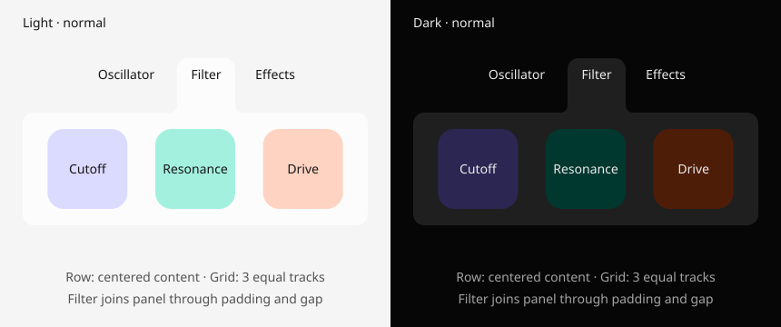

# MUI — Matari UI foundation

Renderer-independent Rust layout, connected surfaces, and derived themes for Matari Audio.
Rust owns the runtime. The optional TypeScript frontend generates Rust builders at build time.

## One item API

`item("name")` is content with layout and appearance. `container([...])` is an unnamed
structural item. Both have the same methods. Choose a layout on the item instead of
switching between separate row, column and box types.

```rust
use mui::prelude::*;

let ui = container([
    container([
        item("osc").text("Oscillator").pad(S).on_tap("select-osc"),
        item("filter").text("Filter").pad(S)
            .extend_to("panel").color(Color::Raised)
            .on_tap("select-filter"),
        item("fx").text("Effects").pad(S).on_tap("select-fx"),
    ])
    .layout(Row).center().gap(S).pad(M).width(Fill),

    item("panel")
        .layout(Grid(3)).pad(L).gap(M).width(Fill)
        .children([
            item("cutoff").width(64.).height(64.),
            item("resonance").width(64.).height(64.),
            item("drive").width(64.).height(64.),
        ]),
])
.layout(Column).width(Fill).height(Hug).gap(M)
.merge(["filter", "panel"])
.build()?
.available_width(360.);
```

This is implemented Rust. The complete runnable example also colors its controls.



Reproduce with `cargo run -p mui-demo --example items > docs/items.svg`.
The example uses schematic text metrics for SVG export; a real UI supplies font metrics.

## Layout and manual overrides

| Method | Meaning |
| --- | --- |
| `.layout(Row)` | Arrange children horizontally; default layout |
| `.layout(Column)` | Arrange children vertically |
| `.layout(Auto)` | Prefer a row; switch to a column when preferred content does not fit |
| `.layout(Grid(3))` | Three equal-width columns; place children left-to-right, then on new rows |
| `.layout(Overlay)` | Place children in the same area |
| `.gap(S)` | Minimum spacing between children or grid tracks |
| `.pad(M)` | Space inside this item around its content |
| `.width(Hug)` / `.height(Hug)` | Size from content |
| `.width(Fill)` / `.height(Fill)` | Use the containing dimension |
| `.width(120.)` / `.height(32.)` | Explicit dimension |
| `.position(Left, Middle)` | Physical horizontal/vertical alignment, independent of flow direction |
| `.center()` | `.position(Center, Middle)` |
| `.pack(SpaceBetween)` | Distribute remaining main-axis space between children |
| `.pack(SpaceEvenly)` | Equal space before, between and after children, in addition to gap |
| `.pack(SpaceAround)` | Half as much outer space as inter-item space, in addition to gap |
| `.align(Align::Stretch)` | Stretch children across the flex cross-axis, or in grid cells |
| `.align_self(Align::End)` | Override this child's cross-axis alignment |
| `.grow(1.)` / `.shrink(1.)` | Weighted flex allocation |
| `.min(w,h)` / `.max(w,h)` | Bounds on item size |
| `.wrap()` | Wrap a fixed row/column; separate from Auto direction |

`pack` follows the actual direction: horizontal in a row and vertical in a column,
including after Auto switches. `position` always refers to screen directions. An explicit
`pack` overrides main-axis positioning, irrespective of builder call order. With no
position override, children start on the main axis and center on the cross axis.
Distribution needs spare space; a content-sized container cannot spread into space it
has not been allocated.

Grid defaults to equal fractional columns and content-sized rows. Manual overrides:

```rust
container([
    item("wide").cell(1, 1).span(2, 1).height(40.),
    item("control").cell(2, 2).place(Right, Bottom),
])
.layout(Grid(2))
.columns([Track::Fixed(80.), Track::Fraction(1.)])
.rows([Track::Fixed(60.), Track::Hug])
.width(Fill)
.gap(S)
```

Cells are **one-based (column, row)**. Unplaced items use automatic placement.
`columns` replaces the default column tracks; `rows` specifies row tracks. `Track::Hug`
uses content size and `Fraction` shares remaining space. On grid, `pack` distributes
horizontal tracks, so it mainly matters for fixed/content tracks that leave spare space.
`position` aligns both the track group and contents inside cells; `place` overrides a
single cell's contents. Overlay supports positioning but rejects distribution.

Auto settles ancestors before descendants and changes each flow at most once per
resolution. It does not retain a direction from the previous frame. Grid is explicit
column-count layout; CSS auto-fit/auto-fill and named grid areas are not exposed.
Physical alignment and per-child overrides do not create absolute coordinates.

Centering a row centers the whole group. For an exactly centered middle item with unequal
side content, use `Grid(3)` with centered cell contents.

## Automatic joining and rounding

```rust
item("filter").extend_to("panel")
// On the containing item:
.merge(["filter", "panel"])
```

One name identifies the item for layout, geometry and interaction. `extend_to` finds the
facing boundaries and grows only the relevant painted edge through padding and gaps.
It never moves text, controls, siblings or original tap bounds. Already overlapping or
touching items need no extra growth. Diagonal separation without perpendicular overlap
is rejected; a direction override cannot invent a sideways bridge. An explicit constraint
is available as `.extend_toward(Direction::Down, "panel")`.

Merge unions the outlines' sharp bases, then rounds the resulting boundary. Both outer
(convex) corners and inner (concave) shoulders inherit the theme automatically.

```rust
.round(S)                              // Same token for both corner types
.round(Rounding::separate(M, S))        // Outer M, inner S
.round(Rounding::separate(M, 0.))       // Outer M, sharp inner corners
```

Tokens use the shared scale; numeric values are pixels. The item hosting `merge` controls
the merged outline's rounding. A merged outline inherits fill/stroke from its first
listed member. Its individual member outlines are omitted from `Ui::outlines`; their
text and interactions remain. Each item may participate in one merge group. Use the
low-level surface API for more involved Boolean compositions.

Paint connected outlines under a shared ancestor clip that includes the entire shape.
MUI does not change a renderer's clipping policy when an outline crosses parent padding.

## Content, appearance and host integration

`text` stores content for real host measurement. Text must be its own child if an item
also contains other children. Resolve with actual font metrics:

```rust
let scene = ui.resolve_with(|id, text, input| {
    // Delegate to your font system, respecting known/available dimensions.
    measure_text(id, text, input)
})?;
```

Use `ui.resolve()` when no text needs external measurement. Render outlines from
`ui.outlines(&scene)`, and text using the original `scene.layout` bounds and `ui.info(id)`.
Items are transparent by default; `.color(Color::Panel)` sets a semantic fill and
`.stroke(Color::Outline, 1.)` adds a stroke. These are renderer-independent descriptions;
the host uses `Color::resolve(&colors)` and the existing egui/tessellation adapter.

`on_tap("select-filter")` stores a host action ID. After your input system recognizes a
completed tap, `ui.tap_at(&scene, x, y)` finds the deepest, last-authored matching action
in the **original layout rectangle**. The host handles clipping, pointer capture, drag
cancellation, focus, keyboard activation, accessibility and action dispatch. This is not
a complete widget/event runtime. A decorative extension is not automatically clickable.

Build with `.build_with(theme)` to select a theme, and rebuild to change it. The compiled
`Ui` exposes its low-level scene read-only via `scene_spec()` for integrations, including
`SceneState` transactional commits. This prevents changing theme spacing while leaving
compiled rounding tokens stale.

Use `.scope("instance")` for reusable components: local `knob` becomes `instance/knob`.
References resolve in the current scope; a leading `/` explicitly addresses the root
(e.g. `.extend_to("/panel")`). Anonymous container identities depend on tree position;
explicitly name dynamic lists. User IDs cannot contain `/` or begin with `@`.

## Automatic hover colors

```rust
item("filter").text("Filter").on_tap("select-filter")
```

Clickable items are automatically hoverable. Use `.hoverable()` for hover feedback
without a click action. No hover color or event handler is required on each item.
By default, hover darkens in light mode and brightens in dark mode using an OKLab tone
shift. Near black/white endpoints the shift reverses if necessary to remain visible.
Transparent items inherit their parent's effective fill (canvas at the root) and get
an opaque hover fill. `.hover_color(Color::PrimarySoft(0))` provides an explicit override.

The host supplies the pointer in scene coordinates and draws resolved styles:

```rust
let colors = ui.theme().colors()?; // Cache for this theme.
let hovered = ui.hover_at(&scene, pointer_x, pointer_y);
let styles = ui.styles(&colors, hovered)?; // Cache until the hover target changes.
// For each outline: styles[outline.id.as_str()].fill / stroke.
// For each text item: styles[item_id].text.
```

The renderer must consume these styles; raw `ItemInfo.color` is only the authored seed.
Text is corrected to at least 4.5:1 against its effective background in both states;
strokes are corrected to 3:1. Descendants of a hovered fill inherit the changed background.
Merged members share one hover color, even when the hovered member is not the first member.
Declare merges on a common ancestor of their members. Hover uses the same original bounds
as tapping, and hovering alone never dispatches an action. A hover-only item blocks taps
through to a clickable ancestor. The host still applies clipping and gesture recognition.

Normal and hover previews are generated from the same Rust example:
[normal](docs/items.svg), [hover on Filter](docs/items-hover.svg).
`cargo run -p mui-demo --example items -- --hover > docs/items-hover.svg` reproduces hover.
Opaque fills are assumed; images, transparency, overlapping unrelated layers and renderer
composition require the host to supply an appropriate contrast policy.

## Themes and contrast

`Theme` shares one spacing scale between layout and geometry, plus a `Palette` with
three primary seeds, one neutral seed and four status seeds (success, warning, error, info).
Optional dark seeds override the light seeds. `Theme::colors()` resolves semantic roles:
canvas, panel, raised, text, muted, outline, and primary/status fill/soft/on-color pairs.

```rust
let theme = Theme { mode: Mode::Dark, ..Theme::default() };
let colors = theme.colors()?; // Cache until the theme or mode changes.
let label = Rgb::new(140, 110, 160).contrast_on(&[colors.panel], 4.5)?;
```

Light and dark use separate OKLab lightness curves, with neutral chroma capped.
Dark elevated surfaces become lighter; this is not a simple RGB inversion. Text and
muted roles meet 4.5:1 against all three neutral surfaces, outlines meet 3:1, and each
accent's on-color meets 4.5:1 against its fill. These are explicit role contracts,
not a promise that every arbitrary pair of palette colors contrasts sufficiently.

`contrast_on` preserves an already-passing color. Otherwise it searches 513 lightness
tones, reduces chroma to fit sRGB, and checks contrast **after 8-bit quantization**.
It returns an error if no sampled candidate meets the requested ratio against every
provided background; it never silently returns a failing color. The search is bounded,
not a proof of the closest possible color or of mathematical infeasibility.

The implementation uses [WCAG relative luminance](https://www.w3.org/WAI/WCAG22/Understanding/contrast-minimum.html)
and [OKLab](https://bottosson.github.io/posts/oklab/). Colors are opaque sRGB; alpha,
gradients and image backdrops need composition-aware handling by the host. Color contrast
alone does not establish complete WCAG accessibility. Derive roles on theme changes,
not in an audio callback or for every painted element.

## Geometry contracts

- Frame surfaces keep a sharp Boolean basis and a rounded render path.
- Merge unions bases before applying the corner profile, so old frame radii do not
  create seams at new junctions.
- Inset/outset offsets the parent's final path. Rounded rectangles use exact analytic
  offsets; general paths use a bounded polygon approximation.
- Derived offset surfaces retain their final material as their Boolean basis when
  merged again. `ParentNormalized` radius matches proportional styling, not shell thickness.
- Surface dependencies are resolved iteratively, once each, independently of declaration
  order. Missing references, cycles, excessive depth, invalid modifiers and budget
  violations are explicit errors. Zero-area unextended frames produce empty surfaces.
- A failed scene/layout commit preserves the previous snapshot and revision.

## Crates and boundaries

| Crate | Responsibility |
| --- | --- |
| `mui-layout` | MUI API, validation, tokens, scoped keys, measurement and adaptive policy over Taffy 0.14 flexbox/grid layout |
| `mui-geometry` | Boolean topology, fillets, paths and offsets |
| `mui-core` | Item authoring, scene graph, automatic extensions and theme derivation |
| `mui-tessellate` | Lyon path-to-mesh adapter |
| `mui-egui` | Painting adapter and tessellation cache |
| `mui` | Facade and prelude |
| `mui-demo` | Compiled TypeScript scenes and reproducible tab SVG |

All reusable Rust crates forbid unsafe code. Layout uses Taffy's f32 calculations
behind MUI's f64 API; geometry uses f64. Layout is rebuilt per resolve, not incrementally
cached. Oversized content is reported as insufficient space; scroll, clipping,
and virtualization are not implemented. Input, focus,
accessibility trees, plugin gestures and native widgets remain future layers.

## TypeScript and verification

`packages/mui-ts/examples/items.ts` uses the same fluent item model, with `.layout("row")`,
`.layout(grid(3))`, `.extendTo("panel")`, `.onTap("select-filter")`, and shared tokens.
The compiler emits a `generated_ui()` builder that is compiled and resolved by Rust tests.
`pill.ts` and `compiler-contract.ts` retain compatibility coverage for the older frontend.
Frontend validation rejects invalid references and values before emission; Rust remains
the runtime authority. There is no JavaScript runtime in the plugin.

Prerequisites: Rust 1.98.1 with rustfmt, Clippy and `wasm32-unknown-unknown`, and Node 24.
TypeScript and Node declarations are project-local, locked dependencies.

```bash
cargo fetch --locked
npm --prefix packages/mui-ts ci
./tools/verify.sh
```

Verification checks formatting, native tests, Clippy with warnings denied, WASM compilation,
TypeScript tests, deterministic Rust generation, the runtime demo and deterministic SVG
export. The suite replaces numerous isolated assertions with 32 Rust contract tests and
4 TypeScript tests covering concrete geometry, layout, failure and frontend behavior.

API migration: `Spacing::resolve` now takes `&SpacingScale`; Theme literals need
`..Theme::default()` for new palette/mode fields. Direct matches on `SurfaceSource::Frame`
must account for `extension`. Layout key separators and adaptive/wrap policies are validated.

The facade prelude now contains item authoring rather than `SurfaceSpec`/`Node` internals.
Low-level APIs and older constructors remain available through `mui::core` and `mui::layout`
for compatibility. Rust has no variable-arity methods: separate rounding values use the
named `Rounding::separate(outer, inner)` constructor rather than a fictitious overloaded call.
