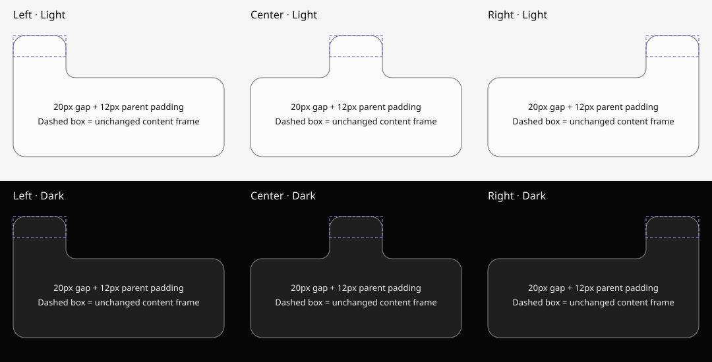

# MUI — Matari UI foundation

Renderer-independent Rust layout, connected surfaces, and derived themes for Matari Audio.
Rust owns the runtime. The optional TypeScript frontend generates Rust builders at build time.

## Compact layout

```rust
use mui::prelude::*;

let controls = flow([
    leaf("gain", 28., 28.),
    leaf("mix", 28., 28.),
])
.axis(Axis::Auto)
.gap(Gap::S)
.pad(Pad::M)
.width(Fill)
.height(Hug);

let scene = resolve_scene(&SceneSpec::new(controls).available_width(240.))?;
```

`flow` defaults to a row. Choose `Axis::Column` explicitly, or `Axis::Auto` to prefer a
single row and switch to a column when its preferred content width does not fit.
Nested auto flows settle ancestors first. Each flow switches at most once per resolve;
there is no previous-frame direction state. `.wrap()` is a separate flex-wrap policy
and cannot be combined with auto direction.

`Hug` measures contents; `Fill` uses the containing dimension. Numeric `.width(120.)`
and `.height(32.)` set dimensions. `.grow(weight)` distributes spare main-axis space;
`.shrink(weight)` permits flex shrink. Fixed leaves are hard intrinsic minimums by
default; measured leaves shrink by default. `.fill()` is the legacy main-axis grow
shortcut, whereas `.width(Fill)` and `.height(Fill)` are dimension-specific.

Rows, columns and overlays support padding, gaps, alignment, justification and min/max.
`Node::measured("label")` with `resolve_scene_measured` supplies available width and known
dimensions to your text/image measurer. `SceneState::commit_measured` publishes the result
transactionally. Text shaping belongs to the host; MUI does not approximate glyph widths.

Structural flows need no IDs. Use `.id("name")` for referenced frames and
`.scope("instance")` for reusable components: a local `knob` becomes `instance/knob`.
Explicit keys cannot contain `/` or start with `@`. Anonymous IDs depend on tree position;
use explicit identities for dynamic lists. There is no retained interaction state yet.

## Tabs across padded columns

```rust
SurfaceSpec::frame("tab", "tab-frame")
    .extend_to(Edge::Bottom, "panel-frame")

// Add the panel frame and merge both surfaces:
SurfaceSpec::merge("shell", ["tab", "panel"])
```

The target is a **layout key**, including its scope when applicable. The selected paint
edge grows to the target's facing edge in shared scene coordinates, through parent padding
and gaps. The other three edges and every content frame stay unchanged. Targets may be
in different layout branches. `Top`, `Right`, `Bottom` and `Left` work the same way.

Sources and targets must have positive area and overlap along the perpendicular axis.
A target in the wrong direction is an error; an already-overlapping target does not
shrink the source. Extension does not itself union surfaces. Merging unites their sharp
bases, then creates the convex corners and concave shoulders of the combined outline.

Paint the merged shell in a shared ancestor layer whose clip includes the entire shell.
The geometry operation does not change a renderer's clipping or hit-testing policy.



Reproduce this SVG with `cargo run -p mui-demo --example chrome_tabs > docs/chrome-tabs.svg`.
The dashed rectangles show the original tab content frames.

## Themes and contrast

`Theme` shares one spacing scale between layout and geometry, plus a `Palette` with
three primary seeds, one neutral seed and four status seeds (success, warning, error, info).
Optional dark seeds override the light seeds. `Theme::colors()` resolves semantic roles:
canvas, panel, raised, text, muted, outline, and primary/status fill/soft/on-color pairs.

```rust
let theme = Theme { mode: Mode::Dark, ..Theme::default() };
let colors = theme.colors()?; // Cache until the theme or mode changes.
let label = Rgb::new(140, 110, 160).contrast_on(&[colors.panel], 4.5)?;
```

Light and dark use separate OKLab lightness curves, with neutral chroma capped.
Dark elevated surfaces become lighter; this is not a simple RGB inversion. Text and
muted roles meet 4.5:1 against all three neutral surfaces, outlines meet 3:1, and each
accent's on-color meets 4.5:1 against its fill. These are explicit role contracts,
not a promise that every arbitrary pair of palette colors contrasts sufficiently.

`contrast_on` preserves an already-passing color. Otherwise it searches 513 lightness
tones, reduces chroma to fit sRGB, and checks contrast **after 8-bit quantization**.
It returns an error if no sampled candidate meets the requested ratio against every
provided background; it never silently returns a failing color. The search is bounded,
not a proof of the closest possible color or of mathematical infeasibility.

The implementation uses [WCAG relative luminance](https://www.w3.org/WAI/WCAG22/Understanding/contrast-minimum.html)
and [OKLab](https://bottosson.github.io/posts/oklab/). Colors are opaque sRGB; alpha,
gradients and image backdrops need composition-aware handling by the host. Color contrast
alone does not establish complete WCAG accessibility. Derive roles on theme changes,
not in an audio callback or for every painted element.

## Geometry contracts

- Frame surfaces keep a sharp Boolean basis and a rounded render path.
- Merge unions bases before applying the corner profile, so old frame radii do not
  create seams at new junctions.
- Inset/outset offsets the parent's final path. Rounded rectangles use exact analytic
  offsets; general paths use a bounded polygon approximation.
- Derived offset surfaces retain their final material as their Boolean basis when
  merged again. `ParentNormalized` radius matches proportional styling, not shell thickness.
- Surface dependencies are resolved iteratively, once each, independently of declaration
  order. Missing references, cycles, excessive depth, invalid modifiers and budget
  violations are explicit errors. Zero-area unextended frames produce empty surfaces.
- A failed scene/layout commit preserves the previous snapshot and revision.

## Crates and boundaries

| Crate | Responsibility |
| --- | --- |
| `mui-layout` | MUI API, validation, tokens, scoped keys, measurement and adaptive policy over Taffy 0.14 flexbox/overlay layout |
| `mui-geometry` | Boolean topology, fillets, paths and offsets |
| `mui-core` | Scene dependency graph, directional extensions and theme derivation |
| `mui-tessellate` | Lyon path-to-mesh adapter |
| `mui-egui` | Painting adapter and tessellation cache |
| `mui` | Facade and prelude |
| `mui-demo` | Compiled TypeScript scenes and reproducible tab SVG |

All reusable Rust crates forbid unsafe code. Layout uses Taffy's f32 calculations
behind MUI's f64 API; geometry uses f64. Layout is rebuilt per resolve, not incrementally
cached. Oversized content is reported as insufficient space; scroll, clipping,
virtualization and a general grid authoring API are not implemented. Input, focus,
accessibility trees, plugin gestures and native widgets remain future layers.

## TypeScript and verification

`packages/mui-ts/examples/pill.ts` demonstrates the original scene;
`compiler-contract.ts` exercises tokens, palettes, extension, Unicode/control strings
and exponent literals through actual compiled Rust. Frontend validation rejects invalid
references and values before emission. Rust remains the runtime authority.

Prerequisites: Rust 1.98.1 with rustfmt, Clippy and `wasm32-unknown-unknown`, and Node 24.
TypeScript and Node declarations are project-local, locked dependencies.

```bash
cargo fetch --locked
npm --prefix packages/mui-ts ci
./tools/verify.sh
```

Verification checks formatting, native tests, Clippy with warnings denied, WASM compilation,
TypeScript tests, deterministic Rust generation, the runtime demo and deterministic SVG
export. The suite replaces numerous isolated assertions with 26 Rust contract tests and
3 TypeScript tests covering concrete geometry, layout, failure and frontend behavior.

API migration: `Spacing::resolve` now takes `&SpacingScale`; Theme literals need
`..Theme::default()` for new palette/mode fields. Direct matches on `SurfaceSource::Frame`
must account for `extension`. Layout key separators and adaptive/wrap policies are validated.
