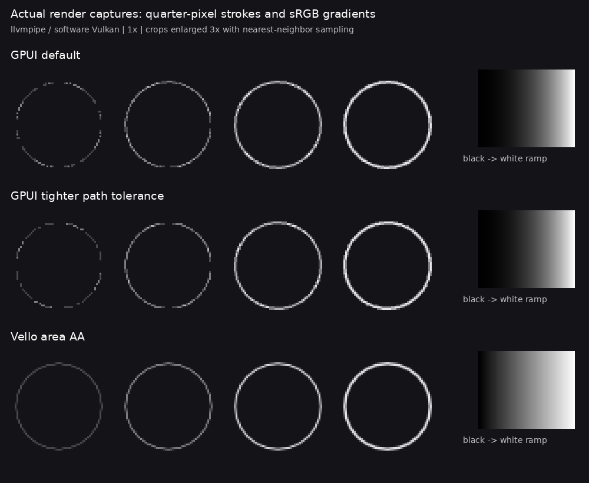

# GPUI / Vello prototype results

**Historical baseline, before the shared gradient patch.** The reproduced gradient
defect is fixed in the [later RX 6600 report](rx6600-gradient-fix-2026-09-13/RESULTS.md). AA remains open.
Renderer rankings below describe their measured fixtures, not the current framework
decision: the plugin experiment uses GPUI and has not adopted a Vello compositor.

**Hardware follow-up:** [RX 6600 results, 2026-09-13](rx6600-2026-09-13/RESULTS.md).
The results below remain the original software-Vulkan baseline.

Both renderers were built and executed against the same MUI geometry. **Vello area AA is
our strongest rendering candidate in this experiment.** Do not switch the whole framework
to GPUI based on rendering performance alone: its tested wgpu path has a reproducible
gradient mismatch and subpixel stroke gaps. GPUI's runtime may still offer useful machinery;
this harness compares rendering and a narrow embedding case, not complete frameworks.

These measurements used **software Vulkan (llvmpipe), not a physical GPU**. They cannot
predict Metal, discrete/integrated GPU performance, power consumption or DAW responsiveness.

## What was tested

The [reproducible harness](../../experiments/render-lab/README.md) pins Zed/GPUI revision
`7960b2a7c9568e90fbe0727332149e5b2a5fd57a`, Vello 0.10.0 and wgpu 29.0.4. Release builds ran
on Mesa 25.2.8 / LLVM 20.1.2 with four llvmpipe worker threads, under Xvfb/X11.

The shared 40-mark fixture includes solid and alpha colors, explicitly sRGB gradients,
actual MUI merged/rounded geometry, holes, concavity, clipping, rotations and thin strokes.
Five rendering configurations ran at 1x, 1.5x and 2x, with additional presentation-inclusive,
2,560-mark stress and repeated-process runs. Captures are actual renderer readbacks.

## Correctness and image quality

| Check | GPUI wgpu | Vello area AA |
|---|---|---|
| Solid RGB/gray/white and alpha patch interiors | Exact match | Exact match |
| Analytic sRGB gray ramp, mean absolute channel error / 255 | 50.69 | 1.55 |
| Quarter-pixel circle centerline samples below 2.5% coverage | 23.97% | 0% |
| Tightened GPUI tessellation, same continuity check | 25.20% | — |
| Exact capture repeatability, three process runs | Passed | Passed |

The gradient test explicitly asks for sRGB interpolation. At one interior sample the analytic
value is approximately 157, Vello produces 156, and GPUI produces 86. Inspection of the pinned
`gpui_wgpu/src/shaders.wgsl` suggests a color-transfer mismatch between
`prepare_gradient_color`, `gradient_color` and the non-sRGB Bgra8Unorm output. This is a
**reproduced mismatch in this pinned wgpu path**, not a claim about every GPUI platform or a
confirmed upstream root cause. No upstream shader or blending changes were made.

The stroke metric uses 4,096 bilinear samples along the true centerline. The 2.5% threshold
is a diagnostic convention, not a standard. Tightening path tolerance does not restore
continuity. Vello MSAA16 also had no samples below this threshold in the 1x fixture.

[Quality measurements](quality.json) also compare against an independent Cairo render at
4x resolution, box-downsampled. Global RGB mean errors at 1x were GPUI 1.447, GPUI-tight
1.443, Vello area 0.251 and Vello MSAA16 0.275. These are **not pure AA scores**: the gradient
mismatch contributes heavily. Cairo is a reference, not ground truth; shared cubic paths
mean the image comparison does not independently prove Boolean geometry correctness.

## Presentation-inclusive performance

Median serialized draw/present/device-wait wall time, milliseconds; lower is better.
Each run has five warmup frames and 60 measured frames. The 1x ranges cover three runs;
2x and stress values come from one run each.

| Workload | GPUI | Vello area AA | Vello MSAA16 |
|---|---:|---:|---:|
| 768 × 512, 40 marks | 9.44–10.40 | 7.79–8.61 | 15.67–16.55 |
| 1536 × 1024, 40 marks | 39.53 | 18.39 | 36.54 |
| 768 × 512, 2,560 marks | 27.82 | 20.27 | 45.49 |

Tighter GPUI tessellation increased the stress median to 72.30 ms without fixing thin-line
continuity. This makes it an unattractive blanket fix for this fixture.

GPUI includes surface acquisition, draw, present and device wait. Vello presentation modes
include acquisition, offscreen render, a texture blit, present and device wait. Scene building
and capture are excluded; encoding is reported separately. Other recorded Vello modes are
offscreen-only and must not be ranked directly against GPUI presentation timings.

These are not GPU timestamps, application FPS or interactive latency. The static scenes do
not exercise a full framework's layout, input or invalidation cost. Driver cache and CPU
contention are uncontrolled, and first-draw timings are not guaranteed shader-cache-cold.
See [GPUI](gpui-1.json), [Vello area](vello-area-present-1.json),
[Vello MSAA16](vello-present-1.json), [stress](stress/) and [repeatability](determinism.json).

## Geometry, embedding and shader probes

- **Geometry:** 1,200 deterministic dimension/gap/radius cases passed finite-path validation,
  flattening, exact extension-target coincidence and logical tap-bound checks. The sweep
  validated 33,600 commands including 14,400 arcs. Maximum measured extension error was zero.
  Build/resolve/validate/flatten median was 0.762 ms, p95 0.973 ms. This is a focused sweep,
  not exhaustive Boolean fuzzing. [Raw results](geometry.json).
- **Embedding:** two actual X11 child windows shared a GPUI GPU context. Parent relationships
  were queried, one child closed while the sibling continued rendering, and three resizes
  rendered successfully. This establishes a useful raw-window-handle renderer integration
  path. It does not validate GPUI App, a DAW, automation, focus/IME or other platforms.
  [Raw results](embedding.json).
- **Glass:** the same custom WGSL blur/refraction/mask/highlight shader ran on each backend's
  captured image, around 4.33–4.34 ms median on llvmpipe. Upload/readback were excluded.
  This demonstrates shared shader capability, not native Apple Liquid Glass, a live backdrop
  compositor or an integrated GPUI custom element. [GPUI input](glass-gpui.png),
  [Vello input](glass-vello.png), [shader](../../experiments/render-lab/src/glass.wgsl).

## Decision and remaining gates

Keep MUI's compact authoring API, intrinsic layout, themes and merged geometry independent
of this experiment. Advance Vello area AA as a candidate backend. Treat GPUI runtime adoption
as a separate decision that must justify its platform and embedding costs.

Before production adoption, rerun on real integrated/discrete GPUs and the intended platforms;
exercise real DAW child-window lifecycle and input; add text/glyph rendering, full UI
invalidation workloads, memory/power measurements and a live custom-shader composition path.
Parley is already integrated into MUI text measurement/layout, but **text rasterization is
not covered by this renderer fixture**. No production backend was changed by this prototype.
