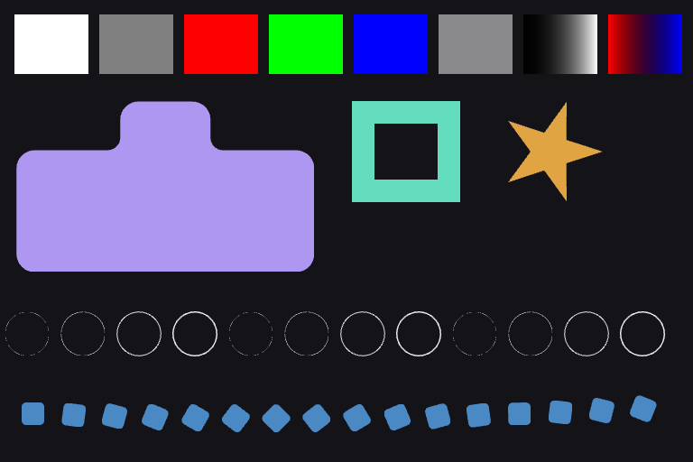
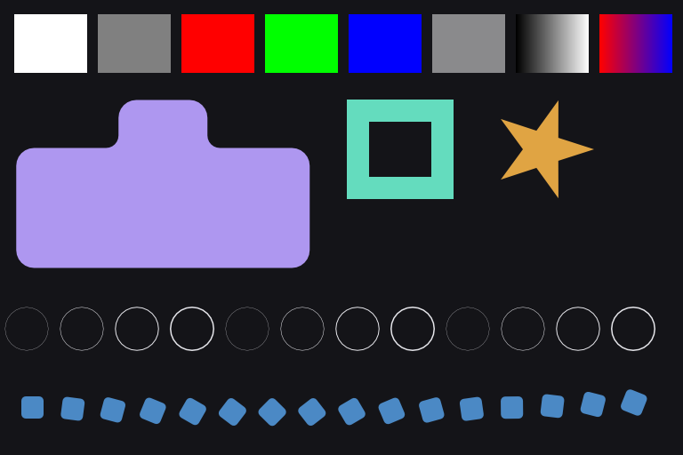

# RX 6600 hardware comparison — 2026-09-13

**Historical baseline, before the shared gradient patch.** The reproduced gradient
defect is fixed in the [later RX 6600 report](../rx6600-gradient-fix-2026-09-13/RESULTS.md). AA remains open.
Renderer rankings below describe their measured fixtures, not the current framework
decision: the plugin experiment uses GPUI and has not adopted a Vello compositor.

**Vello area AA remains the stronger candidate for MUI's custom vector surfaces.**
GPUI is slightly faster drawing the small prebuilt scene, but Vello area is about
4.5–6.3 times faster in the path-heavy stress fixture and avoids the reproduced
gradient and thin-stroke defects. This compares rendering, not complete frameworks.
It does not establish that combining GPUI's runtime with Vello is worthwhile.

The intrinsic-surface/Parley/render-lab branch was merged to `main` in
[PR #2](https://github.com/Matari-Audio/MUI/pull/2), commit `099ca16`.
Its full local verification and GitHub Verify workflow passed before these results
were published. The separate `feat/preview-gallery` development line is not part
of this merge or this experiment.

## Machine and method

- AMD Radeon RX 6600, **physical discrete GPU**, Vulkan, Mesa RADV 26.2.2-arch3.2.
- Ryzen 7 7800X3D; Rust 1.98.1; optimized release build using the pinned lab lockfile.
- GPUI revision `7960b2a7c9568e90fbe0727332149e5b2a5fd57a`; Vello **0.10.0 compute
  renderer**, not Vello Hybrid; wgpu 29.0.4.
- All 59 adapter-bearing reports were checked for RX 6600, DiscreteGpu and Vulkan.
- A dedicated rootful Xwayland display at 1920×1200 ran under the desktop compositor.
  The normal tiled display resized the benchmark windows and produced suboptimal
  swapchains; those incomplete attempts were discarded. Renderer and harness Rust
  sources are unchanged. Only the existing upstream readback instrumentation is used.
- Standard matrix: 40 marks, 1×/1.5×/2×, GPUI/default and tight tolerance, Vello
  area/MSAA8/MSAA16, 60 samples each. Presentation, 2,560-mark stress, repeated
  captures, geometry, child windows and glass probes also ran.
- Longer comparison: three processes per case, 300 samples per process, five warmup
  frames, rotating backend order between runs. See [long/](long/).

[Environment](environment.json) records the exact source revision, kernel and device selection.
These are CPU wall-clock draw/present/device-wait measurements, **not GPU timestamps,
application FPS, input-to-display latency, or measurements inside a DAW**. The
compositor and other desktop activity were not isolated; GPU clocks and power were
not pinned. No CPU compilation was intentionally run alongside the final matrix.

## Presentation-inclusive results

Ranges of per-process medians in milliseconds, across the three 300-sample runs:

| Prebuilt workload | GPUI | Vello area AA | Vello MSAA16 |
|---|---:|---:|---:|
| 768×512, 40 marks | 0.374–0.404 | 0.460–0.500 | 0.553–0.590 |
| 1536×1024, 40 marks | 0.432–0.491 | 0.539–0.553 | 0.619–0.626 |
| 768×512, 2,560 marks | 4.294–4.767 | 0.755–0.961 | 0.925–0.983 |

GPUI times include acquisition, draw, presentation and device wait. Vello times
include acquisition, offscreen rendering, an additional texture blit, presentation
and device wait. Offscreen-only Vello measurements are recorded separately and
must not be ranked directly against these GPUI presentation times.

Tail latency varied: small-scene per-run p95 values ranged from 0.91 to 5.65 ms
across these backends; stress p95 was 5.32–8.22 ms for GPUI, 1.30–1.32 ms for
Vello area and 1.21–1.39 ms for Vello MSAA16. The small median differences should
not be interpreted as a universal latency advantage.

Scene encoding is excluded above and measured separately. Stress encoding medians
were 7.83–7.85 ms for GPUI and 2.91–2.96 ms for Vello area. Small-scene encoding
was about 0.13–0.14 ms versus 0.04–0.05 ms. These include the lab's SVG path parsing
and adapter construction, not just native renderer overhead.

Tighter GPUI tessellation took 11.92 ms median to draw the stress case in its
60-sample run, plus 11.45 ms encoding. It did not fix stroke continuity.

## Color and anti-aliasing

| 1× diagnostic | GPUI | GPUI tight | Vello area | Vello MSAA16 |
|---|---:|---:|---:|---:|
| Solid/alpha patch maximum channel error | 0 | 0 | 0 | 0 |
| sRGB gray-ramp mean error, 0–255 channel units | 50.71 | 50.71 | 1.56 | 1.56 |
| Quarter-pixel circle centerline below 2.5% coverage | 24.22% | 25.39% | 0% | 0% |
| Global RGB mean error against Cairo reference | 1.445 | 1.447 | 0.251 | 0.275 |

The GPUI gradient mismatch and thin-stroke gaps reproduce on hardware; they were
not specific to llvmpipe. This conclusion applies to this pinned GPUI wgpu path,
not every GPUI renderer or platform. The suspected color-transfer root cause in
the earlier report has not been confirmed or patched.

Global RGB error is not a pure AA score because it includes the gradient mismatch.
The reference is Cairo rendered at 4× then box-downsampled, not mathematical ground
truth. The 2.5% coverage threshold is a diagnostic convention. Full regional and
scale-specific results are in [quality.json](quality.json).

Actual 1× readbacks, inspected visually:

GPUI:



Vello area:



## Other probes

- Geometry: all 1,200 seeded cases passed; 33,600 commands and 14,400 arcs checked.
  Maximum extension-target error was zero. Build/resolve/validate/flatten median
  was 0.490 ms, p95 0.502 ms. [Geometry](geometry.json).
- Exact RGBA repeatability passed across three processes for GPUI, Vello area-present
  and Vello MSAA16-present. [Hashes](determinism.json).
- Two actual X11 child windows shared a GPUI GPU context; both parent relationships,
  surviving sibling after close, and three resizes passed. This is renderer embedding,
  not GPUI App, focus/IME, automation or DAW lifecycle validation. [Embedding](embedding.json).
- The shared glass compute shader ran on both captures: median 0.084 ms on GPUI's
  input and 0.120 ms on Vello's input, ten samples each, excluding upload/readback.
  This is the same shader on different images, not a meaningful backend-speed ranking
  or proof of integrated live GPUI+Vello composition. [GPUI](glass-gpui.json),
  [Vello](glass-vello.json).
- **Typography rasterization is absent from this fixture.** Parley text-layout tests
  passed in the main verification suite, but no GPUI-versus-Vello glyph quality or
  text-rendering performance claim follows from these results.

## Reproduce

Use an available display number and a dedicated rootful Xwayland server to avoid
the desktop window manager changing fixture dimensions:

```sh
Xwayland :89 -geometry 1920x1200 -nolisten tcp
```

In another terminal, with Pillow, numpy and CairoSVG available to Python:

```sh
cd experiments/render-lab
DISPLAY=:89 MESA_VK_DEVICE_SELECT='1002:73ff!' ZED_DEVICE_ID=0x73ff \
  CARGO_TARGET_DIR=target ./tools/run.sh
```

`CARGO_TARGET_DIR=target` matches the runner's expected binary path. For the longer
comparison, repeat `gpui`, `vello-area-present` and `vello-present` with 300 samples
at scales 1 and 2 and the scale-1 tile-side-8 stress case, three separate process
runs each, rotating backend order. All commands and argument meanings are documented
in the [lab README](../../../experiments/render-lab/README.md).

**Remaining decision gates:** text rasterization, real plugin-host lifecycle and
input, full UI invalidation, memory/power, other platforms, and any combined-runtime
prototype. The hardware evidence supports keeping MUI's geometry/layout independent
and advancing Vello area for rendering; it does not justify adopting GPUI's whole
framework on speed alone.
